# Project 1 Planning: The Unofficial Guide

> Write this document before you write any pipeline code.
> Your spec and architecture diagram are what you'll use to direct AI tools (Claude, Copilot, etc.) to generate your implementation — the more specific they are, the more useful the generated code will be.
> Update the Retrieval Approach and Chunking Strategy sections if you change your approach during implementation.
> Update this file before starting any stretch features.

---

## Domain

<!-- What domain did you choose? Why is this knowledge valuable and hard to find through official channels? -->

This system covers real student experiences with tech internships, collected from 
student communities on Reddit (r/csMajors, r/cscareerquestions). It includes reviews 
of FAANG and startup internships, compensation data, remote vs. in-person comparisons, 
red flags to watch for, and advice on landing a first internship.

This knowledge is valuable because it doesn't exist in any structured, searchable 
format through official channels — it's scattered across thousands of threads and 
comments. A student trying to find out "what is WLB actually like at Google" has no 
way to get a consolidated answer without reading dozens of posts manually.

---

## Documents

<!-- List your specific sources: URLs, subreddit names, forum threads, or file descriptions.
     Aim for at least 10 sources that together cover different subtopics or perspectives within your domain. -->

| # | Source | Description | URL or location |
|---|--------|-------------|-----------------|
| 1 | r/csMajors | Google SWE internship experience — bad WLB, office politics, return offer rates | https://www.reddit.com/r/csMajors/comments/1ic6vxn/google_software_engineer_internship_2025/ |
| 2 | r/csMajors | FAANG internship resume value — how Amazon/Google intern experience affects future hiring | https://www.reddit.com/r/csMajors/comments/1t7j0kf/former_amazon_sde_interns_how_much_value_did_the/ |
| 3 | r/csMajors + r/cscareerquestions | Startup vs big tech internship — red flags, learning quality, career tradeoffs | https://www.reddit.com/r/csMajors/comments/1lfhutc/think_twice_before_you_work_for_any_startup/ |
| 4 | r/csMajors | How to get your first internship — projects, networking, application strategy | https://www.reddit.com/r/csMajors/comments/1nzx3l9/genuinely_how_are_you_supposed_to_get_your_first/ |
| 5 | r/csMajors | What you actually learn at a SWE internship — technical and non-technical takeaways | https://www.reddit.com/r/csMajors/comments/155ur6y/what_i_learned_from_my_internship_i_dont_want_to/ |
| 6 | r/csMajors + r/cscareerquestions | Internship salary and compensation — real numbers from FAANG, mid-size, and small companies | https://www.reddit.com/r/cscareerquestions/comments/1pnwh5n/official_salary_sharing_thread_for_new_grads/ |
| 7 | r/csMajors | Remote vs in-person internship — student preferences and tradeoffs | https://www.reddit.com/r/csMajors/comments/13nzjrb/interns_is_your_internship_remote_or_in_person/ |
| 8 | r/cscareerquestions + r/csMajors | Getting hired with zero experience — real stories of first internships | https://www.reddit.com/r/cscareerquestions/comments/r78kvz/got_hired_with_zero_experience/ |
| 9 | r/cscareerquestions | Questions to ask before accepting an internship offer | https://www.reddit.com/r/cscareerquestions/comments/8zw6bw/what_questions_do_you_ask_the_company_before_you/ |
| 10 | r/csMajors + r/cscareerquestions | Red flags in internship job descriptions and toxic internship experiences | https://www.reddit.com/r/csMajors/comments/qfr7gq/what_red_flags_do_you_notice_when_you_look_at/ |

---

## Chunking Strategy

<!-- How will you split documents into chunks?
     State your chunk size (in tokens or characters), overlap size, and explain why those
     numbers fit the structure of your documents.
     A review-heavy corpus warrants different chunking than a long FAQ. -->

**Chunk size:** 500 characters

**Overlap:** 50 characters

**Reasoning:**

The documents are Reddit threads made up mostly of short user comments (1–4 sentences 
each). Chunking by paragraph doesn't work well here because many "paragraphs" are 
just one sentence — not enough context to embed meaningfully.

500 characters fits a typical Reddit comment almost perfectly. Smaller than that and 
you get mid-sentence fragments. Larger and you start merging opinions from completely 
different users into one chunk, which kills retrieval precision.

The 50-character overlap is there to handle the longer posts (like 03_startup_vs_bigtech 
and 10_red_flags) where a single comment spans multiple chunks — overlap makes sure 
a key idea that sits near a boundary doesn't get lost.

Every chunk gets stored with its source filename as metadata for attribution later.

---

## Retrieval Approach

<!-- Which embedding model are you using (e.g., all-MiniLM-L6-v2 via sentence-transformers)?
     How many chunks will you retrieve per query (top-k)?
     If you were deploying this for real users and cost wasn't a constraint, what tradeoffs
     would you weigh in choosing a different embedding model — context length, multilingual
     support, accuracy on domain-specific text, latency? -->

**Embedding model:** all-MiniLM-L6-v2 via sentence-transformers — runs locally, 
no API key needed, no rate limits. Good enough for English-only opinion text.

**Top-k:** 5 — enough context for the LLM to work with without flooding it with 
loosely related chunks.

**Production tradeoff reflection:** For a real deployment I'd look at a few things: 
context length matters if documents get longer than what MiniLM handles well (256 
tokens is its sweet spot). If the corpus went multilingual — say, Spanish-speaking 
students sharing internship experiences — I'd need a model like multilingual-e5 
instead. For latency-sensitive apps, a hosted API model (like OpenAI embeddings) 
trades local control for speed and accuracy on domain-specific text. For this use 
case, local + free wins.

---

## Evaluation Plan

<!-- List your 5 test questions with their expected correct answers.
     Questions should be specific enough that you can judge whether the system's response
     is right or wrong. "What are good dining halls?" is too vague.
     "What do students say about wait times at [dining hall name] during lunch?" is testable. -->

| # | Question | Expected answer |
|---|----------|-----------------|
| 1 | What do students say about work-life balance at Google internships? | Multiple reviewers report poor WLB — managers messaging after hours, some interns working 60+ hours/week near deadlines. Experience varies by team. (Source: 01_google_internship) |
| 2 | How much do FAANG interns typically make per month? | Amazon: ~$10,500/month + housing stipend. Microsoft: ~$7,500/month + housing. Google/FAANG range: $7,500–$12,000/month depending on role and location. (Source: 06_internship_salary_compensation) |
| 3 | What are the red flags to watch for in internship job descriptions? | Phrases like "we are a family," "fast-paced environment," "rockstar developer," unpaid positions, no mention of pay or benefits, and requiring years of experience for entry-level roles. (Source: 10_red_flags_internship) |
| 4 | What do students recommend for getting a first internship with no experience? | Apply anyway — don't wait. Use projects, clubs, and hackathons to fill the resume. Networking and referrals matter more than qualifications. Cold apply to smaller companies first. (Source: 08_first_internship_no_experience, 04_how_to_get_internship) |
| 5 | What are the tradeoffs between remote and in-person internships? | In-person is better for networking, mentorship, and learning. Remote offers flexibility and saves commute time but requires intentional relationship-building to avoid going under the radar. (Source: 07_remote_vs_inperson_internship) |

---

## Anticipated Challenges

<!-- What could go wrong? Name at least two specific risks with reasoning.
     Consider: noisy or inconsistent documents, missing source attribution, off-topic
     retrieval, chunks that split key information across boundaries. -->

1. **Short comments embedding poorly:** Many comments are 1–2 sentences, which may 
not carry enough semantic signal for the embedding model to distinguish them from 
unrelated chunks. A query about salary might pull back a comment that just mentions 
a number in a different context. I actually hit something similar in my NLP class — 
I was chunking a dense technical book to build a chatbot for non-technical users, 
and the chunks kept coming back as jargon-heavy fragments that made no sense out of 
context. Worried the same thing could happen here with the shorter comments.

2. **Key opinions split across chunk boundaries:** Some longer posts (like the startup 
warning in doc 03 or the ML internship story in doc 10) have multi-paragraph arguments 
where the conclusion only makes sense with the setup. If those get split, retrieval 
might return the second half of an argument with no context, and the LLM won't be 
able to use it well.
---

## Architecture

<!-- Draw a diagram of your pipeline showing the five stages:
     Document Ingestion → Chunking → Embedding + Vector Store → Retrieval → Generation
     Label each stage with the tool or library you're using.
     You can use ASCII art, a Mermaid diagram, or embed a sketch as an image.
     You'll use this diagram as context when prompting AI tools to implement each stage. -->

```mermaid
flowchart LR
    A[📁 Raw .txt files\ndocuments/] -->|pathlib| B[Document Ingestion\nPython / pathlib]
    B -->|clean text| C[Chunking\n500 chars, 50 overlap]
    C -->|chunk + metadata| D[Embedding\nall-MiniLM-L6-v2\nsentence-transformers]
    D -->|vectors + metadata| E[(Vector Store\nChromaDB)]
    E -->|top-5 chunks| F[Retrieval\nChromaDB semantic search]
    F -->|context + query| G[Generation\nGroq llama-3.3-70b-versatile]
    G --> H[📝 Grounded answer\n+ source citations]
```

---

## AI Tool Plan

<!-- For each part of the pipeline below, describe:
     - Which AI tool you plan to use (Claude, Copilot, ChatGPT, etc.)
     - What you'll give it as input (which sections of this planning.md, which requirements)
     - What you expect it to produce
     - How you'll verify the output matches your spec

     "I'll use AI to help me code" is not a plan.
     "I'll give Claude my Chunking Strategy section and ask it to implement chunk_text()
     with my specified chunk size and overlap" is a plan. -->

**Milestone 3 — Ingestion and chunking:**
I'll give Claude the Documents section (10 .txt files, Reddit thread format) and the 
Chunking Strategy section (500 chars, 50 overlap). I'll ask it to implement an 
ingest.py script that loads all files from documents/, strips the SOURCE/TOPIC header 
lines, and returns chunks with source filename attached as metadata. I'll verify by 
printing 5 random chunks and checking they're readable and self-contained.

**Milestone 4 — Embedding and retrieval:**
I'll give Claude the Architecture diagram and the Retrieval Approach section. I'll 
ask it to implement embed_and_store() using all-MiniLM-L6-v2 and ChromaDB, and a 
retrieve() function that returns top-5 chunks with distance scores and source metadata. 
I'll verify by running 3 of my evaluation questions and checking that distance scores 
are below 0.5 and results are on-topic.

**Milestone 5 — Generation and interface:**
I'll give Claude the grounding requirement (answer only from retrieved context, cite 
sources) and the Gradio skeleton from the project instructions. I'll ask it to 
implement generate_response() using Groq's llama-3.3-70b-versatile and wire it into 
a Gradio UI. I'll verify by asking a question outside my documents and confirming 
the system declines to answer instead of hallucinating.
